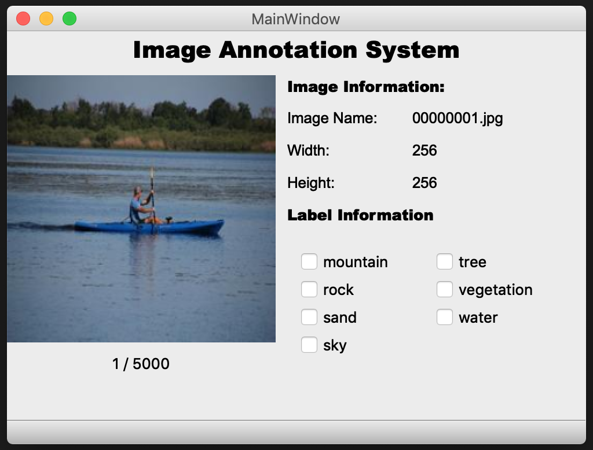

# pyImgLabel

pyImgLabel is a simple barebones multi class image classification annotation system.

# Quickstart
## Install required packages
- Install PyQt5
- Install OpenCV: `pip install opencv-python`
- Install imutils
- Install pandas

## Update Configurations
- Update labels.txt
- Update constants.py

